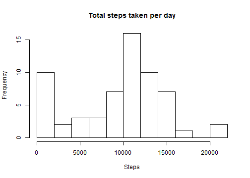
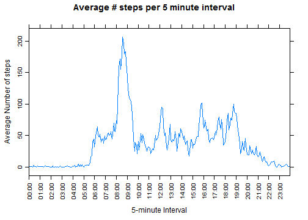
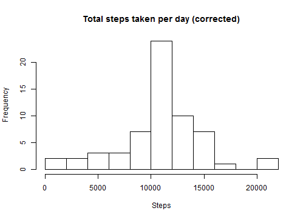
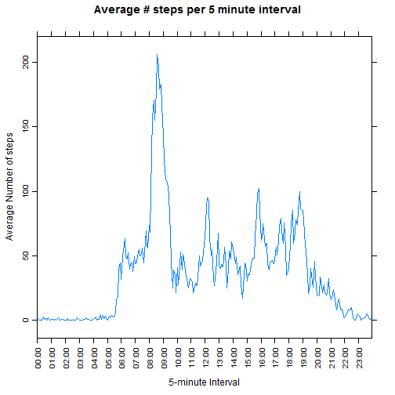

<!-- 
  Note:  For consistency, don't use "Knit HTML".  Instead, in the R Console,
  run the command:  knit2html("PA1_template.Rmd")
  -->

## Loading and preprocessing the data

1. Show any code that is needed to load the data
2. Show any code that is needed to process/transform the data (if necessary)
   into a format suitable for your analysis


```r
# The assignment said, "feel free to use any plotting system in R", I kept it
# simple and stuck with 1) base graphics for histograms, and 2) lattice graphics
# for panel plots.
library(lattice)
library(dplyr)
```

```r
# Unzip the data into a "data" folder which GIT will ignore (see the file .gitignore)
# We specify the column classes in advance, and then convert the interval from
# an integer to a human-readable factor.
unzip("activity.zip", exdir = "data")
activity <- read.csv("data/activity.csv", colClasses=c("integer", "Date", "integer"))
activity$interval <- as.factor(sub("(\\d\\d)(\\d\\d)", "\\1:\\2", 
                         sprintf("%4.4d", activity$interval)))
```

## What is mean total number of steps taken per day?

For this part of the assignment, you can ignore the missing values in the dataset.

1. Calculate the total number of steps taken per day

2. Make a histogram of the total number of steps taken each day

3. Calculate and report the mean and median of the total number of steps taken per day


```r
# Calculate daily sum, then the mean and median of the sums (so we can compare, later)
dailySum <- activity %>% group_by(date) %>%
            summarise_each(funs(sum(., na.rm = TRUE)), steps)
dailyMean <- mean(dailySum$steps)
dailyMedian <- median(dailySum$steps)

# Histogram of total number of steps taken per day
hist(dailySum$steps, breaks=10, xlab="Steps", main="Total steps taken per day")
```

 

```r
# Print the mean and median values (rounded to one decimal place)
print(paste("Mean of daily sum:", round(dailyMean, 1)))
```

```
## [1] "Mean of daily sum: 9354.2"
```

```r
print(paste("Median of daily sum:", round(dailyMedian, 1)))
```

```
## [1] "Median of daily sum: 10395"
```

## What is the average daily activity pattern?

1. Make a time series plot of the 5-minute interval (x-axis) and the average number of steps taken, averaged across all days (y-axis)

2. Which 5-minute interval, on average across all the days in the dataset, contains the maximum number of steps?


```r
intervalMeans <- activity %>% group_by(interval) %>%
                 summarise_each(funs(mean(., na.rm = TRUE)), steps)
maxEntryIndex <- which.max(intervalMeans$steps)

xTickAt = seq(1, 12*24, by=12) # one label every hour on the x axis
xLabels = intervalMeans$interval[xTickAt]
p <- xyplot(steps ~ interval, data=intervalMeans, type="l",
            main="Average # steps per 5 minute interval",
            xlab="5-minute Interval", ylab="Average Number of steps",
            scales=list(x=list(at=xTickAt,labels=xLabels), rot=90))
print(p)
```

 

```r
print(paste("5-minute interval with the most average steps: ", 
            intervalMeans$interval[maxEntryIndex], " with ",
            round(intervalMeans$steps[maxEntryIndex], 1), " steps",
            sep=""))
```

```
## [1] "5-minute interval with the most average steps: 08:35 with 206.2 steps"
```

## Imputing missing values

Note that there are a number of days/intervals where there are missing values. The presence of missing days may introduce bias into some calculations or summaries of the data.

1. Calculate and report the total number of missing values in the dataset

2. Devise a strategy for filling in all of the missing values in the dataset.

3. Create a new dataset that is equal to the original dataset but with the missing data filled in.

4. Make a histogram of the total number of steps taken each day and calculate and report the mean and median total number of steps taken per day. Do these values differ from the estimates from the first part of the assignment? What is the impact of imputing missing data on the estimates of the total daily number of steps?


```r
naValues <- sum(is.na(activity$steps))
print(paste("Number of NA values:", naValues, "out of", nrow(activity)))
```

```
## [1] "Number of NA values: 2304 out of 17568"
```

```r
newActivity <- activity
for (i in 1:nrow(newActivity)) {
  if (is.na(newActivity$steps[i])) {
    intervalIndex <- intervalMeans$interval == newActivity$interval[i]
    newActivity$steps[i] = intervalMeans[intervalIndex,]$steps
  }
}

newDailySum <- newActivity %>% group_by(date) %>%
                summarise_each(funs(sum(., na.rm = TRUE)), steps)
newDailyMean <- mean(newDailySum$steps)
newDailyMedian <- median(newDailySum$steps)

# Histogram of corrected total number of steps taken per day
hist(newDailySum$steps, breaks=10, xlab="Steps", 
     main="Total steps taken per day (corrected)")
```

 

```r
# Print the corrected mean and median values (rounded to one decimal place)
# Also compare to our original computations with missing values
print(paste("Mean of corrected daily sum: ", round(newDailyMean, 1),
            ", (Compare to ", round(dailyMean, 1), ")",
            sep=""))
```

```
## [1] "Mean of corrected daily sum: 10766.2, (Compare to 9354.2)"
```

```r
print(paste("Median of corrected daily sum: ", round(newDailyMedian, 1),
            ", (Compare to ", round(dailyMedian, 1), ")",
            sep=""))
```

```
## [1] "Median of corrected daily sum: 10766.2, (Compare to 10395)"
```

## Are there differences in activity patterns between weekdays and weekends?

Use the dataset with the filled-in missing values for this part.

1. Create a new factor variable in the dataset with two levels – “weekday” and “weekend” indicating whether a given date is a weekday or weekend day.

2. Make a panel plot containing a time series plot of the 5-minute interval (x-axis) and the average number of steps taken, averaged across all weekday days or weekend days (y-axis). See the README file in the GitHub repository to see an example of what this plot should look like using simulated data.


```r
intervalMeans <- newActivity %>%
    mutate(dayType = as.factor(ifelse(weekdays(newActivity$date) %in%
                                        c("Saturday","Sunday"), "Weekend", "Weekday"))) %>%
    group_by(interval, dayType) %>%
    summarise_each(funs(mean(., na.rm = TRUE)), steps)

#########
# FIXME: Due to interval being a factor, the X axis labels get screwed up, even
# though the plot itself is correct.  Changing the xTickAt works around the
# issue, but it's a kludge.  Would like something better even though that kludge
# works perfectly.
#########
xTickAt = seq(1, 12*24*2, by=24) # one label every hour on the x axis
xLabels = intervalMeans$interval[xTickAt]
xTickAt = seq(1, 12*24, by=12) # one label every hour on the x axis
p <- xyplot(steps ~ interval | levels(dayType), data=intervalMeans, type="l",
            layout=c(1,2), main="Average # steps per 5 minute interval",
            xlab="5-minute Interval", ylab="Average Number of steps",
            scales=list(x=list(at=xTickAt,labels=xLabels), rot=90))
print(p)
```

 

<!-- Clean temporary variables from the environment -->

