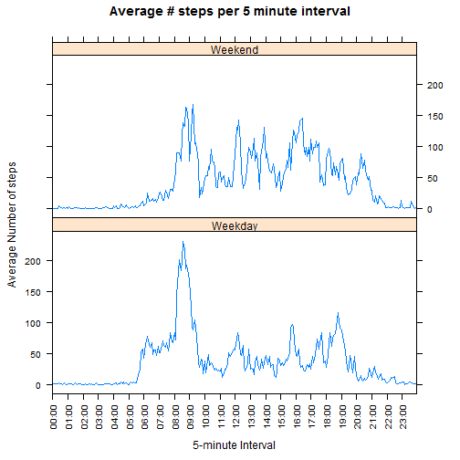

# Reproducible Research: Peer Assessment 1

<!-- 
  Notes:  
  * For consistency, don't use RStudio's "Knit HTML" button.  Instead, in
    the R Console, run the command:  knit2html("PA1_template.Rmd")
  * We could set the global option to force echo for knitr, but doing so is the
    default behavior so there is no need.
  * Normally, much of the output would be in the markdown portion and not the
    code chunk portion.  However, the grading rubric asks, "Does the report show
    all of the R code needed to reproduce the results (numbers, plots, etc.) in
    the report?"  To meet that part of the rubric, print() was used in a code
    chunk to display the results requested.
  -->

## Loading and preprocessing the data

1. Show code to load the data.
2. Show code to process/transform the data into a format suitable for your analysis.


```r
# The assignment said, "feel free to use any plotting system in R", I kept it
# simple and stuck with 1) base graphics for histograms, and 2) lattice graphics
# for panel plots.
library(lattice)
library(dplyr)
```


```r
# Unzip the data into a "data" folder which GIT will ignore (see the file
# .gitignore). We specify the column classes in advance.  We convert the
# interval from an integer to a human-readable factor.
unzip("activity.zip", exdir = "data")
activity <- read.csv("data/activity.csv", colClasses=c("integer", "Date", "integer"))
activity$interval <- as.factor(sub("(\\d\\d)(\\d\\d)", "\\1:\\2", 
                         sprintf("%4.4d", activity$interval)))
```

## What is mean total number of steps taken per day?

For this part of the assignment, ignore missing values in the dataset.

1. Calculate the total number of steps taken per day.
2. Make a histogram of the total number of steps taken each day.
3. Calculate and report the mean and median of the total number of steps taken
   per day.


```r
# Calculate daily sum, then the mean and median of the sums (so we can compare, later)
dailySum <- activity %>% group_by(date) %>%
            summarise_each(funs(sum(., na.rm = TRUE)), steps)
dailyMean <- mean(dailySum$steps)
dailyMedian <- median(dailySum$steps)

# Histogram of total number of steps taken per day
hist(dailySum$steps, breaks=10, xlab="Steps", main="Total steps taken per day")
```

 

```r
# That's a big bump at zero ... how many are exactly 0.0?
zeroDays <- sum(dailySum$steps == 0)
totalDays <- length(dailySum$steps)
print(paste(zeroDays, " of ", totalDays, " days (", 
            round(100 * zeroDays / totalDays, 1), "%) have no steps at all",
            sep=""))
```

```
## [1] "8 of 61 days (13.1%) have no steps at all"
```

```r
# Print the mean and median values (rounded to one decimal place)
print(paste("Mean of daily sum:", round(dailyMean, 1)))
```

```
## [1] "Mean of daily sum: 9354.2"
```

```r
print(paste("Median of daily sum:", round(dailyMedian, 1)))
```

```
## [1] "Median of daily sum: 10395"
```

## What is the average daily activity pattern?

1. Make a time series plot of the 5-minute intervals and the average number of
   steps taken, averaged across all days
2. Which 5-minute interval, on **average** across all the days in the dataset,
   contains the maximum number of steps?


```r
# Sum intervals across all days
intervalMeans <- activity %>% group_by(interval) %>%
                 summarise_each(funs(mean(., na.rm = TRUE)), steps)

# Plot average number of steps for each interval.  Our X axis is a factor, so
# we have to explicitly say where to put labels and what labels.
xTickAt <- seq(1, 12*24, by=12) # one label every hour on the x axis
xLabels <- intervalMeans$interval[xTickAt]
p <- xyplot(steps ~ interval, data=intervalMeans, type="l",
            main="Average # steps per 5 minute interval",
            xlab="5-minute Interval", ylab="Average Number of steps",
            scales=list(x=list(at=xTickAt, labels=xLabels, rot=90)))
print(p)
```

 

```r
# Figure out which data.frame row has the maximum average number of steps
maxEntry <- intervalMeans[which.max(intervalMeans$steps),]
print(paste("5-minute interval with the maximum average number of steps: ", 
            maxEntry$interval, " with ", round(maxEntry$steps, 1), " steps",
            sep=""))
```

```
## [1] "5-minute interval with the maximum average number of steps: 08:35 with 206.2 steps"
```

_What is the average daily activity pattern?_

The daily activity pattern is pretty variable.  The subjects clearly started to
wake up around 5:30 AM, as that is when activity begins to increase from a
baseline value very close to 0.  There is a clear spike of activity around
lunch time.  Between 7 PM and midnight, activity gradually dropped toward 0.

## Imputing missing values

There are a number of days/intervals where there are missing values. This may
introduce bias into some calculations or summaries of the data.

1. Calculate and report the total number of missing values in the dataset.
2. Devise a strategy for filling in all of the missing values in the dataset.
3. Create a new dataset that is equal to the original dataset but with the
   missing data filled in.
4. Make a histogram of the total number of steps taken each day.
5. Calculate and report the mean and median total number of steps taken per day.


```r
# Count missing values
naValues <- sum(is.na(activity$steps))
naDays <- length(unique(activity[is.na(activity$steps), "date"]))
print(paste("There are ", naValues, " missing values out of ", nrow(activity),
            " (", round(100 * naValues / nrow(activity), 1), "%), on ", naDays,
            " different days, averaging ", naValues/naDays, " per day",
            sep=""))
```

```
## [1] "There are 2304 missing values out of 17568 (13.1%), on 8 different days, averaging 288 per day"
```

```r
# Strategy: replace NA values with the mean of all non-NA values for the same
# 5-minute time interval across all days. Note that the group_by(interval) 
# causes the "mean" to calculate along that variable.  While steps are measured
# as integers, one will least disturb the distribution of values by using the
# mean (even when it's not an integer) for imputed values.
# This new dataset is the same as "activity" but with missing values filled in.
newActivity <- activity %>% group_by(interval) %>%
  mutate(steps = ifelse(is.na(steps), mean(steps, na.rm=TRUE), steps))

# Recompute the daily sums now that we have imputed missing values
newDailySum <- newActivity %>% group_by(date) %>%
                summarise_each(funs(sum(., na.rm = TRUE)), steps)
newDailyMean <- mean(newDailySum$steps)
newDailyMedian <- median(newDailySum$steps)

# Histogram of corrected total number of steps taken per day
hist(newDailySum$steps, breaks=10, xlab="Steps", 
     main="Total steps taken per day (corrected)")
```

 

```r
# Print the corrected mean and median values (rounded to one decimal place).
# Also compare to our original computations with missing values.
meanDiff <- round((newDailyMean - dailyMean) / dailyMean * 100, 1)
print(paste("Mean of corrected daily sum: ", round(newDailyMean, 1),
            " (uncorrected is ", round(dailyMean, 1), "), a change of ",
            meanDiff, "%",
            sep=""))
```

```
## [1] "Mean of corrected daily sum: 10766.2 (uncorrected is 9354.2), a change of 15.1%"
```

```r
medianDiff <- round((newDailyMedian - dailyMedian) / dailyMedian * 100, 1)
print(paste("Median of corrected daily sum: ", round(newDailyMedian, 1),
            " (uncorrected is ", round(dailyMedian, 1), "), a change of ",
            medianDiff, "%",
            sep=""))
```

```
## [1] "Median of corrected daily sum: 10766.2 (uncorrected is 10395), a change of 3.6%"
```

```r
# Compare corrected and uncorrected histograms on one plot
transRed <- rgb(1, 0, 0, 0.6)
transBlue <- rgb(0, 0, 1, 0.6)
hist(newDailySum$steps, breaks=10, xlab="Steps", 
     main="Total steps taken per day (corrected vs uncorrected)", col=transRed)
hist(dailySum$steps, breaks=10, add=TRUE, col=transBlue)
legend("topright", legend=c("Corrected","Uncorrected"), 
       fill=c(transRed, transBlue))
```

 

```r
# After imputation, do we still have days with 0.0 steps?
newZeroDays <- sum(newDailySum$steps == 0)
print(paste("After imputation, ", newZeroDays, " of ", totalDays, " days (", 
            round(100 * newZeroDays / totalDays, 1), "%) have no steps at all",
            sep=""))
```

```
## [1] "After imputation, 0 of 61 days (0%) have no steps at all"
```

```r
if (zeroDays > 0) {
  reduction <- round(-100 * (newZeroDays - zeroDays) / zeroDays, 1)
  print(paste("This is a reduction of ", reduction, "%", sep=""))
}
```

```
## [1] "This is a reduction of 100%"
```

_Do these values differ from the estimates from the first part of the assignment?_
_What is the impact of imputing missing data on the estimates of the total daily_
_number of steps?_

* The median and mean both changed ... to the same value!  Both increased from
  their uncorrected values.  This shouldn't be surprising.  When calculating
  **total** steps per day, missing values will cause these totals to be
  artificially low.  Restoring approximate values for the missing values should
  restore the mean and median (of total steps per day) to be much closer to 
  their actual value.
* Imputing missing values removed a large spike at 0 in the histogram.  All the
  missing values were entire days.  So all of the days that were entirely
  missing moved to the same spot in the histogram, as can be seen in the plot
  showing both histograms on one plot.
* Since missing values were imputed as the mean non-missing value across all
  days for the same 5-minute time interval, and only whole days were missing,
  the missing days all moved from 0 steps to the mean number of steps across
  all days.  It is no surprise that the corrected median is the same value as
  the mean!

## Are there differences in activity patterns between weekdays and weekends?

Use the dataset with the filled-in missing values for this part.

1. Create a new factor variable in the dataset with two levels (Weekend/Weekday).
2. Make a panel plot containing a time series plot of the 5-minute interval
   (x-axis) and the average number of steps taken, averaged across all weekday
   days or weekend days (y-axis). See the
   [README](./instructions_fig/sample_panelplot.png) file to see an example 
   using simulated data of what this plot should look like.


```r
# Yes, this assumes that weekday names are returned in English...
dayTypeColumn <- ifelse(weekdays(newActivity$date) %in% c("Saturday", "Sunday"),
                        "Weekend", "Weekday")
# Calculate averages across all weekend days and weekday days into a new data.frame.
# Note that without ungroup() the mutate call to add the factor won't work.
dayTypeIntervalMeans <- newActivity %>% ungroup() %>%
    mutate(dayType = as.factor(dayTypeColumn)) %>%
    group_by(interval, dayType) %>%
    summarise_each(funs(mean(., na.rm = TRUE)), steps) %>%
    arrange(interval, dayType)

# For the chart to work, the data.frame must be sorted by the x axis value first.
# Thus, we have to take every second item on the x axis to get the labels.
# If there were 3 "dayType" values, we'd have to take every third item.
xTickAt <- seq(1, 12*24, by=12) # one label every hour on the x axis
xLabels <- dayTypeIntervalMeans$interval[xTickAt * 2]
p <- xyplot(steps ~ interval | levels(dayType), data=dayTypeIntervalMeans, type="l",
            layout=c(1,2), main="Average # steps per 5 minute interval",
            xlab="5-minute Interval", ylab="Average Number of steps",
            scales=list(x=list(at=xTickAt, labels=xLabels, rot=90)))
print(p)
```

 

_Are there differences in activity patterns between weekdays and weekends?_

Yes!

* **Weekday activity is clearly tied to employment.**  There is a spike of
  activity in the morning that starts around 5:30 AM, most likely as the
  subjects prepare for and arrive at work.  There is a period of lower activity
  between about 9:30 AM and 5 PM with a burst of activity for lunch and a spike
  before around 4 PM.  The spike around 4 PM may represent early risers leaving
  work around 3:30 PM.  Between roughly 5 PM and 7 PM, there is more activity
  than during the work day.  Finally, by about 8pm, activity is pretty close to
  zero and remains that way for the rest of the evening.
* **Weekend activity is more variable.** Activity increases more slowly in the
  morning (and later in the morning) when compared to weekdays.  The subjects
  were active later on weekend nights as well. There was no obvious pattern to
  weekend activity.

<!--
I wanted to see if the individual days had much variation, and they did.  I'll
leave this code in here because I found it interesting, but I'll entirely
suppress it from the output because it is too far outside what was asked for.
-->


<!-- Clean temporary variables from the environment -->

